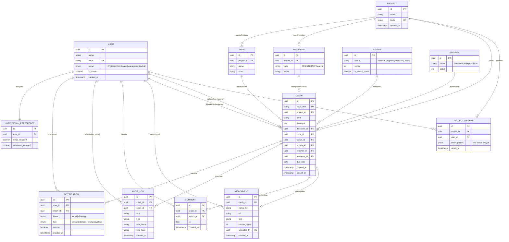

# Entity Relationship Diagram — ClashHub

**Turunan dari:** ClashHub PRD v1.0 (31 Juli 2026)
**Basis data acuan:** PostgreSQL (relasional) — sesuai rekomendasi Bagian 4.2

---

## 1. Diagram ER (Mermaid)

---

## 2. Ringkasan Entitas

| Entitas | Peran dalam sistem | Referensi PRD |
|---|---|---|
| **PROJECT** | Kontainer utama; semua clash, disiplin, dan zona bersifat per-proyek (multi-proyek). | 4.3, US-D2, US-F1 |
| **USER** | Akun pengguna dengan peran RBAC (Engineer/Coordinator/Management/Admin). | 2.1, 4.3, US-F1 |
| **PROJECT_MEMBER** | Tabel jembatan many-to-many User ↔ Project; menentukan keanggotaan & assignee valid per proyek. | US-B2, US-F1 |
| **DISCIPLINE** | Master data disiplin (ARS/STR/MEP/lainnya) per proyek. | 2.3 US-A1, US-F1 |
| **ZONE** | Master data lokasi/zona/level per proyek. | US-A1, US-F1 |
| **STATUS** | Master data status alur kerja (Open → In Progress → Resolved → Closed). | 2.2, US-F1 |
| **PRIORITY** | Master data prioritas berbobot. | US-A1, US-F1 |
| **CLASH** | Entitas inti — clash/issue dengan ID unik; pusat seluruh relasi. | 2.2, 4.3 |
| **ATTACHMENT** | Lampiran (gambar/PDF) milik satu clash. | US-A1, 4.3 |
| **COMMENT** | Diskusi/komentar pada halaman rincian clash. | US-C1, 4.3 |
| **AUDIT_LOG** | Jejak audit tak-terhapus per perubahan status/assignment. | US-B2, 4.5 |
| **NOTIFICATION** | Instans notifikasi Email/WhatsApp yang terkirim. | US-E1 |
| **NOTIFICATION_PREFERENCE** | Preferensi kanal per user (1:1). | US-E1 |

---

## 3. Relasi Kunci (Kardinalitas)

| Relasi | Kardinalitas | Keterangan |
|---|---|---|
| Project → Clash | 1 : N | Satu proyek berisi banyak clash. |
| Project ↔ User | M : N (via `PROJECT_MEMBER`) | Satu user bisa di banyak proyek; satu proyek punya banyak user. |
| User → Clash (reporter) | 1 : N | Pelapor clash. |
| User → Clash (assignee) | 1 : N | Penanggung jawab; nullable saat belum di-triase. |
| Discipline / Zone / Status / Priority → Clash | 1 : N | Klasifikasi via master data (FK, bukan teks bebas). |
| Clash → Attachment | 1 : N | ≥ 5 file, maks 10 MB/file (US-A1). |
| Clash → Comment | 1 : N | Diskusi kronologis. |
| Clash → Audit_Log | 1 : N | Setiap perubahan tercatat (siapa, kapan, nilai lama→baru). |
| Clash → Notification | 1 : N | Dipicu oleh assign/status change/overdue. |
| User → Notification_Preference | 1 : 1 | Setelan kanal email/WhatsApp. |

---

## 4. Catatan Desain

- **Master data sebagai tabel referensi** (Discipline, Zone, Status, Priority) — bukan kolom teks — agar bisa dikelola Admin (US-F1) dan dipakai untuk filter/agregasi dashboard yang cepat (US-B1, US-D1).
- **Indeks disarankan** pada `CLASH(project_id, status_id, priority_id, discipline_id, zone_id, assignee_id, due_date, created_at)` untuk memenuhi target performa register & dashboard (Bagian 4.6).
- **`STATUS.is_closed_state`** menandai status penutup sehingga KPI "open vs closed" dan `closed_at` konsisten.
- **`AUDIT_LOG` immutable** — hanya insert, tanpa update/delete (Bagian 4.5).
- **Peran ganda User pada Clash** (reporter & assignee) diwakili dua FK terpisah ke tabel `USER`.
- **Di luar cakupan v1** (Bagian 2.4): tidak ada entitas untuk viewer 3D, deteksi clash otomatis, atau scheduling — sesuai Non-Goals PRD.
